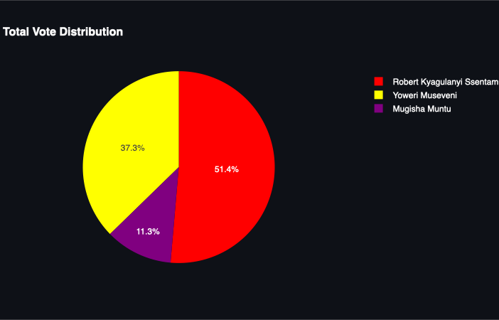

# 🇺🇬 Realtime Voting Engineering 🗳️

**Project Repository:** [GitHub Link](https://github.com/Smartlyfe21/RealtimeVotingEngineering.git)  

A **real-time voting system** built for Uganda’s upcoming 2026 general election, designed to simulate and display live election results for the three leading candidates. This system demonstrates a novel approach to election monitoring using modern **data engineering, streaming, and visualization technologies**.  

---

## 📌 Overview

- This project simulates a **real-time voting platform** for Uganda, a country that currently does not have live election monitoring.
- It focuses on the **top three presidential candidates**:  
  1. **Yoweri Museveni** – National Resistance Movement (NRM)  
  2. **Robert Kyagulanyi Ssentamu** – National Unity Platform (NUP)  
  3. **Mugisha Muntu** – Alliance for National Transformation (ANT)  
- The system collects votes, processes them in real-time, and displays **live vote counts** along with visualizations.  

---

## ⚙️ Key Features

1. **Real-time Vote Streaming**  
   - Votes are produced and consumed using **Kafka**.  
   - Each vote includes: candidate, district, timestamp, and slogan.  

2. **Database Management**  
   - Votes and voter data are stored in **PostgreSQL**.  
   - Tables include `candidates`, `voters`, and `votes_stream`.  

3. **Candidate Management**  
   - Insert, store, and display information about each candidate including:  
     - Biography  
     - Campaign platform  
     - Slogan  
     - Image  

4. **Live Dashboard**  
   - Shows real-time vote counts per candidate.  
   - Displays pie charts (currently screenshot-based) for vote distribution.  
   - Candidate images can be displayed alongside live vote counts.  

5. **Multithreading & Realistic Simulation**  
   - Simulates up to 50,000 voters with multi-threading.  
   - Gradual probability-based vote assignment ensures realistic results.  

---

## 🛠️ Technologies Used

- **Python** – Core programming language  
- **PostgreSQL** – Relational database for storing voters, candidates, and votes  
- **Kafka** – Real-time vote streaming  
- **Faker** – Generating fake voter data for simulation  
- **PIL (Python Imaging Library)** – Displaying candidate images  
- **Multithreading** – Handling large-scale vote insertion and simulation  
- **Dashboard Visualizations** – Pie charts and live vote updates  

---

## 📊 Live Election Example

**Total Votes:** 80,000  

| Candidate | Votes | Percent |
|-----------|-------|---------|
| Robert Kyagulanyi Ssentamu | 41,098 | 51.37% |
| Yoweri Museveni | 29,834 | 37.29% |
| Mugisha Muntu | 9,068 | 11.34% |

**Pie Chart:**  


**Candidate Images:**  


---

## 🚀 How to Run

1. **Install dependencies:**  
```bash
pip install -r requirements.txt

## 🚀 How to Run

1. **Install dependencies:**  
```bash
pip install -r requirements.txt

Start PostgreSQL database and create votes_db.
Run the main script:
python main.py

Producer and consumer threads will automatically start, simulating votes and streaming them to Kafka.
View live dashboard to monitor vote counts and pie chart visualization.

Repository Structure
RealtimeVotingEngineering/
│
├─ main.py              # Main execution script
├─ voting.py            # Voting simulation logic
├─ spark-streaming.py   #  integration for Spark streaming
├─ images/              # Candidate images & pie chart screenshots
├─ requirements.txt     # Python dependencies
└─ README.md

License
This project is licensed under the MIT License.
MIT License

Permission is hereby granted, free of charge, to any person obtaining a copy
of this software and associated documentation files (the "Software"), to deal
in the Software without restriction, including without limitation the rights
to use, copy, modify, merge, publish, distribute, sublicense, and/or sell
copies of the Software, and to permit persons to whom the Software is
furnished to do so, subject to the following conditions:

The above copyright notice and this permission notice shall be included in all
copies or substantial portions of the Software.

THE SOFTWARE IS PROVIDED "AS IS", WITHOUT WARRANTY OF ANY KIND, EXPRESS OR
IMPLIED, INCLUDING BUT NOT LIMITED TO THE WARRANTIES OF MERCHANTABILITY,
FITNESS FOR A PARTICULAR PURPOSE AND NONINFRINGEMENT. IN NO EVENT SHALL THE
AUTHORS OR COPYRIGHT HOLDERS BE LIABLE FOR ANY CLAIM, DAMAGES OR OTHER
LIABILITY, WHETHER IN AN ACTION OF CONTRACT, TORT OR OTHERWISE, ARISING FROM,
OUT OF OR IN CONNECTION WITH THE SOFTWARE OR THE USE OR OTHER DEALINGS IN THE
SOFTWARE.
